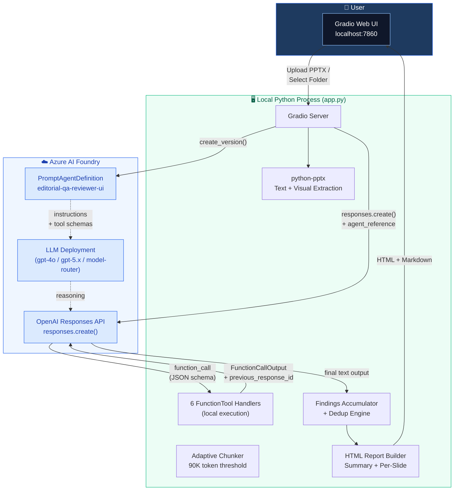
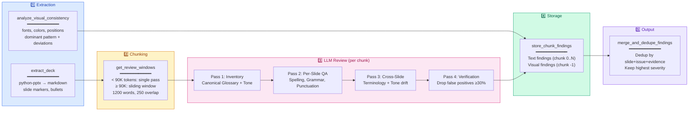
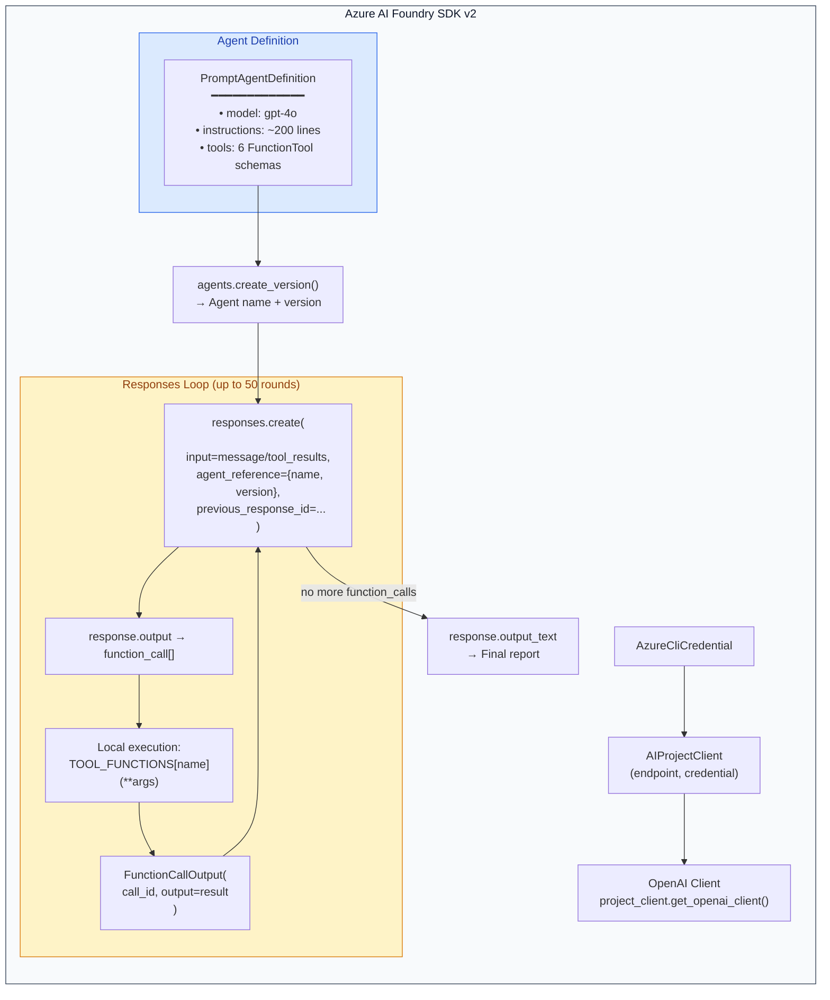
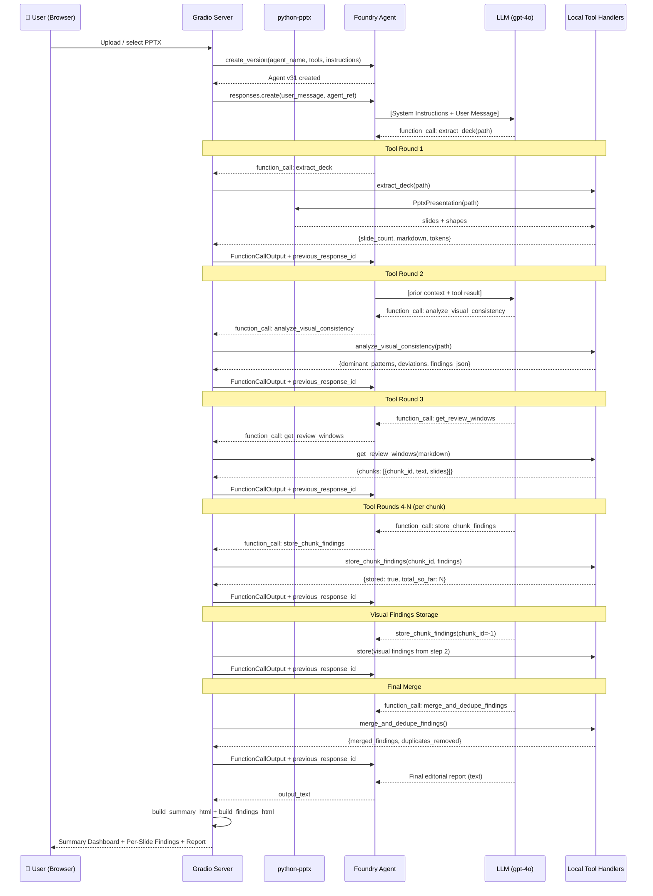

# Editorial QA Agent — Solution Deep-Dive

> **AI-powered editorial review pipeline** that reads PowerPoint decks, finds **spelling, grammar, punctuation, terminology, tone, visual consistency, and layout** issues, and produces a structured QA report — powered by **Microsoft Azure AI Foundry**.

---

## Table of Contents

1. [What It Does](#1-what-it-does)
2. [High-Level Architecture](#2-high-level-architecture)
3. [Technology Stack](#3-technology-stack)
4. [The 6 Function Tools](#4-the-6-function-tools)
5. [Pipeline Flow (5 Stages)](#5-pipeline-flow-5-stages)
6. [How Agent Orchestration Works](#6-how-agent-orchestration-works-sdk-pattern)
7. [Detailed Sequence](#7-detailed-sequence-full-review-run)
8. [The 4-Pass Editorial Review Process](#8-the-4-pass-editorial-review-process)
9. [Visual Consistency Analysis](#9-visual-consistency-analysis-deterministic)
10. [Findings Format & Severity](#10-findings-format--severity)
11. [Deduplication Logic](#11-deduplication-logic)
12. [Cross-Chunk Context](#12-cross-chunk-context-via-previous_response_id)
13. [UI Output](#13-ui-output-3-tabs)
14. [Key Design Decisions](#14-key-design-decisions)
15. [Fine-Grained Function Reference](#15-fine-grained-function-reference)
16. [How to Run](#16-how-to-run)

---

## 1. What It Does

An AI-powered editorial review pipeline that:

- Reads PowerPoint (`.pptx`) files using `python-pptx`
- Extracts both **text content** (as markdown) and **visual metadata** (fonts, colors, positions, sizes)
- Splits large decks into overlapping review windows for manageable processing
- Uses an **Azure AI Foundry Agent** (LLM) to perform a rigorous 4-pass editorial review
- Runs a **deterministic visual consistency analysis** — comparing every slide's fonts, colors, and layout against the deck's dominant patterns
- Produces a structured QA report with severity-ranked findings, evidence, and remediation suggestions
- Renders results in a Gradio web UI with summary dashboard, per-slide drill-down, and full agent report

---

## 2. High-Level Architecture



### Key Architectural Insight: Split-Brain Design

| Where | What runs | Data exposure |
|-------|-----------|---------------|
| **Local machine** | All data processing: PPTX extraction, chunking, visual analysis, dedup, HTML rendering | PPTX files never leave the machine |
| **Azure cloud** | Only LLM reasoning: the model receives text chunks and returns editorial findings | Only extracted text is sent to Azure |
| **Not used** | No embeddings, no vector databases, no RAG | Entire deck processed directly |

---

## 3. Technology Stack

| Layer | Technology | Version | Purpose |
|-------|-----------|---------|---------|
| **Frontend** | Gradio (Python) | — | Web UI at `localhost:7860` — model selector, instructions editor, 3-tab results |
| **PPTX Parsing** | `python-pptx` | — | Extract text (markdown) + visual metadata (fonts, colors, positions, sizes) |
| **Agent SDK** | `azure-ai-projects` | 2.0.1 | `AIProjectClient`, `PromptAgentDefinition`, `FunctionTool` |
| **LLM API** | OpenAI Responses API | — | `responses.create()` with `agent_reference` and `previous_response_id` |
| **Auth** | `azure-identity` | — | `AzureCliCredential` — AAD-based auth, no keys stored |
| **Config** | `python-dotenv` | — | `.env` file with `AZURE_AI_PROJECT_ENDPOINT` + `AZURE_AI_MODEL_DEPLOYMENT_NAME` |
| **Runtime** | Python | 3.12.10 | Virtual environment at `.venv/` |

### Azure Resources

| Resource | Details |
|----------|---------|
| **Foundry Project** | *(set via `AZURE_AI_PROJECT_ENDPOINT` in `.env`)* |
| **Tenant** | *(your Azure AD tenant)* |
| **Subscription** | *(your Azure subscription)* |
| **Available Models** | `gpt-4o`, `gpt-4o-mini`, `gpt-4.1-mini`, `gpt-5.1`, `gpt-5.1-chat`, `gpt-5.2`, `model-router` |
| **Default Model** | `gpt-4o` (configurable via `.env` or UI dropdown) |

---

## 4. The 6 Function Tools

The agent has 6 tools registered as **JSON schemas**. The **LLM decides** which tool to call and when. **All execution happens locally** — the LLM only sees the tool's JSON schema definition and the string result returned after local execution.

| # | Tool Name | What It Does | Deterministic? | Called By |
|---|-----------|-------------|---------------|----------|
| 1 | `extract_deck` | Parses PPTX → markdown with `# Slide N` markers, returns word count + token estimate | ✅ Yes | LLM (step 1) |
| 2 | `analyze_visual_consistency` | Extracts visual metadata, computes dominant patterns, returns **only deviations** as pre-formatted findings | ✅ Yes | LLM (step 2) |
| 3 | `get_review_windows` | Splits markdown into chunks. <90K tokens = single pass; ≥90K = sliding window (1200 words, 250 overlap) | ✅ Yes | LLM (step 3) |
| 4 | `store_chunk_findings` | Stores editorial findings from one chunk into an in-memory accumulator | ✅ Yes | LLM (steps 4-5) |
| 5 | `merge_and_dedupe_findings` | Deduplicates by (slide + issue + evidence), keeps highest severity, sorts results | ✅ Yes | LLM (step 6) |
| 6 | `extract_deck_visual` | Raw visual metadata dump (fallback — `analyze_visual_consistency` is preferred) | ✅ Yes | LLM (rarely) |

**Important**: 5 of 6 tools are fully deterministic Python — no LLM needed. Only the editorial text review (what the LLM does *between* calling `get_review_windows` and `store_chunk_findings`) requires LLM reasoning.

---

## 5. Pipeline Flow (5 Stages)



### Stage Details

| Stage | What Happens | Who Does It |
|-------|-------------|-------------|
| **1. Extraction** | PPTX parsed into markdown (text) + visual metadata (fonts, colors, positions). Two parallel extractions. | Local Python (`python-pptx`) |
| **2. Chunking** | Markdown split into review windows. Small decks (<90K tokens) = single pass. Large decks = 1200-word windows with 250-word overlap. | Local Python |
| **3. LLM Review** | For each chunk: 4-pass editorial review (inventory → per-slide QA → cross-slide consistency → verification). The LLM reasons about spelling, grammar, punctuation, terminology, and tone. | Azure LLM (gpt-4o) |
| **4. Storage** | Each chunk's findings stored in `findings_accumulator` list. Visual findings stored with `chunk_id=-1`. | Local Python |
| **5. Output** | All findings deduplicated, sorted by severity → slide number, rendered as HTML dashboard. | Local Python |

---

## 6. How Agent Orchestration Works (SDK Pattern)



### The Loop in Plain English

1. **Client sends user message** → Foundry (via `responses.create()`)
2. **Model responds** with `function_call` objects (e.g., "call `extract_deck` with this path")
3. **Client executes the function locally** using `TOOL_FUNCTIONS[name](**args)` and sends back `FunctionCallOutput`
4. **Model sees the result**, decides next step, may call another tool
5. **Repeat** until the model returns text (no more tool calls) — up to 50 rounds
6. **`previous_response_id` chains the conversation server-side** — so chunk 5's review sees all context from chunks 1-4

### Why Client-Side Tools (FunctionTool)?

- `FunctionTool` = only JSON schema stored in Foundry; execution is 100% local
- vs. Foundry's server-side tools (Code Interpreter, File Search) which execute in the cloud
- **Benefit**: PPTX files never leave the machine. LLM only sees extracted text strings.
- **Trade-off**: Tools don't appear in the Foundry portal UI (only the schema is stored, not the code)

---

## 7. Detailed Sequence (Full Review Run)



### Typical Tool Round Count

| Deck Size | Chunks | Tool Rounds | Approximate |
|-----------|--------|-------------|-------------|
| Small (20 slides, ~5K tokens) | 1 (single pass) | 5-7 | extract → visual → windows → store_text → store_visual → merge |
| Medium (50 slides, ~30K tokens) | 1 (single pass) | 5-7 | Same as above |
| Large (200 slides, ~120K tokens) | ~5-8 (windowed) | 10-15 | extract → visual → windows → (store × N chunks) → store_visual → merge |

---

## 8. The 4-Pass Editorial Review Process

This is what the **LLM does** for each text chunk — instructed via the ~200-line system prompt:

| Pass | Name | What Happens | Output |
|------|------|-------------|--------|
| **1** | **Inventory** | Build a *Canonical Glossary* of recurring terms, acronyms, product names, metrics. Choose canonical form by most common/formal usage. Identify the dominant tone in 1-2 sentences. | Internal glossary + tone baseline |
| **2** | **Per-Slide QA** | Scan each slide for spelling, grammar, and punctuation issues. Flag tone anomalies only when clearly divergent from surrounding slides. | Candidate findings list |
| **3** | **Cross-Slide Consistency** | Using the glossary, flag terminology drift (e.g., "real-time" vs "real time"), inconsistent acronym usage, and tone shifts between slides. | Extended findings list |
| **4** | **Verification (MANDATORY)** | Re-read every finding. Ask: *"Can I point to the EXACT wrong text and explain precisely why it is wrong?"* Drop anything subjective, stylistic, or layout-related. **Must eliminate ≥30% of initial findings.** | Final filtered findings |

### 7 Must-Flag Categories

| # | Category | What's Flagged |
|---|----------|---------------|
| 1 | **Spelling** | Typos, misspellings, incorrect word forms, wrong proper nouns |
| 2 | **Grammar** | Agreement errors, tense inconsistency, broken sentences, incorrect articles |
| 3 | **Punctuation** | Missing punctuation, inconsistent style, broken quotes, inconsistent hyphenation |
| 4 | **Terminology** | Same concept named multiple ways across slides (capitalization, hyphenation, acronyms) |
| 5 | **Tone** | Shifts suggesting multiple authors (formal vs casual, marketing hype vs neutral) |
| 6 | **Visual** | Inconsistent fonts, sizes, colors, positioning across slides |
| 7 | **Layout** | Cluttered slides, overlapping shapes, poor alignment, confusing hierarchy |

### Zero False-Positive Policy

> *"It is far worse to flag a non-issue than to miss a real one. When in doubt, do NOT flag it."*

The system prompt explicitly tells the LLM:
- Do NOT flag bullet-point style phrasing (PPT slides are not prose)
- Do NOT flag missing periods on headings/bullets
- Do NOT flag statistics unless there's an internal contradiction
- Do NOT flag missing articles ("a", "the") in bullet items
- Every finding MUST include exact verbatim evidence text — no evidence = no finding

---

## 9. Visual Consistency Analysis (Deterministic)

The `analyze_visual_consistency` tool runs **entirely in Python** — no LLM needed. It performs 15+ checks:

### How It Works

1. **Extract** all shapes from every slide using `python-pptx` (position, size, fonts, colors, rotation, fill)
2. **Classify** shapes per slide:
   - First text shape = **title**
   - Remaining text shapes = **body**
   - Non-text shapes with fill color = **decorative**
3. **Compute dominant pattern** using `collections.Counter` frequency counts:
   - Most common title font, size, color, bold/italic, position (top/left), width
   - Most common body font, size, color, bold/italic
   - Most common accent fill color
   - Average shape count per slide
4. **Detect deviations** — any slide that differs from the dominant is flagged

### Check Matrix

| Check Type | Checks Performed | Severity |
|-----------|-----------------|----------|
| **Cross-slide title** | Font family, font size, bold, italic, text color, position (top/left), shape width | High |
| **Cross-slide body** | Font family, font size, bold, italic, text color | Medium |
| **Within-slide body mixing** | Multiple fonts/sizes/colors on same slide | Medium |
| **Accent fills** | Decorative shape fill color deviation | Medium |
| **Layout: Clutter** | Shape count > 2× deck average AND > 6 shapes | Medium |
| **Layout: Overlap** | Bounding-box intersection between text shapes | Critical |
| **Layout: Crammed margins** | Shape position < 0.3" from edge | Medium |
| **Layout: Misaligned columns** | Top positions vary > 0.3" among ≥3 body shapes | Medium |
| **Layout: Rotation** | Non-zero rotation on any shape | Low |

### Automatic Exclusions

- **Slide 1** (cover slide) — always excluded from visual checks
- **Last slide** (closing slide) — always excluded from visual checks
- These are expected to have intentionally different styling

---

## 10. Findings Format & Severity

### Finding Structure

Every finding (text or visual) follows this JSON structure:

```json
{
  "slides": "Slide 5",
  "evidence": "exact verbatim text or measured property description",
  "issue": "description of WHY it's wrong",
  "flag": "Critical",
  "remediation": "suggested fix",
  "category": "Spelling"
}
```

### Severity Scale

| Level | Meaning | Examples |
|-------|---------|---------|
| **Critical** | Immediate credibility loss | Overlapping text making content unreadable, embarrassing typos in titles |
| **High** | Customer will notice | Title font mismatch across slides, clear grammar errors, inconsistent bold/italic on titles |
| **Medium** | Erodes polish | Body font deviation, terminology drift, within-slide font mixing, minor alignment drift |
| **Low** | Minor preference | Slight spacing differences, decorative shape rotation |

### Categories

| Category | Icon | Source |
|----------|------|--------|
| Spelling | 📝 | LLM review |
| Grammar | 📐 | LLM review |
| Punctuation | ✏️ | LLM review |
| Terminology | 🔖 | LLM review |
| Tone | 🎭 | LLM review |
| Visual | 🎨 | Deterministic analysis |
| Layout | 📏 | Deterministic analysis |

---

## 11. Deduplication Logic

When chunks overlap (250-word overlap in windowed mode), the same finding may be detected twice. `merge_and_dedupe_findings` handles this:

### Algorithm

1. **Build dedup key** for each finding: `lowercase(slides) | lowercase(issue) | lowercase(evidence)`
2. **If duplicate key exists**: Keep the finding with the **higher severity rank**
   - Critical=4 > High=3 > Medium=2 > Low=1
3. **Sort final list**: Primary = severity (descending), Secondary = slide number (ascending)

### Example

If Chunk 0 finds a "Medium" spelling error on Slide 12, and Chunk 1 (which overlaps with Chunk 0) finds the same error but classifies it as "High", the merged result keeps only the "High" version.

---

## 12. Cross-Chunk Context via `previous_response_id`

For large decks (≥90K tokens), the text is split into overlapping windows. The agent maintains context across chunks through the Foundry SDK's conversation chaining:

### How It Works

```
Turn 1: responses.create(input=user_message)           → response_1
Turn 2: responses.create(input=tool_results, previous_response_id=response_1.id) → response_2
Turn 3: responses.create(input=tool_results, previous_response_id=response_2.id) → response_3
...
Turn N: model sees entire chain of reasoning from turns 1 through N-1
```

- The `previous_response_id` field tells Foundry to **chain the conversation server-side**
- The model at Turn 6 has access to all prior reasoning from Turns 1-5
- The canonical glossary built during Chunk 1's Pass 1 is available when reviewing Chunk 5
- Terminology like "Azure AI" vs "Azure A.I." flagged in Chunk 1 will also be caught in Chunk 5

### Why This Matters

Without `previous_response_id`, each chunk review would be stateless — the agent would rebuild the glossary from scratch and miss cross-chunk terminology inconsistencies.

---

## 13. UI Output (3 Tabs)

| Tab | Content | Implementation |
|-----|---------|---------------|
| **📊 Summary Dashboard** | Severity cards (Critical/High/Medium/Low counts), category breakdown with bar charts, per-deck breakdown (multi-deck mode), quick-look findings table | `build_summary_html()` |
| **🔍 Per-Slide Findings** | Expandable `<details>` sections per slide. Each shows: slide content preview (monospace), finding cards with evidence (yellow box), issue description, suggested fix (green box), severity badges. Clean slides listed at bottom. | `build_findings_html()` |
| **📝 Full Agent Report** | Raw markdown report from the LLM — includes the glossary, tone analysis, and all findings in prose form | `build_report_md()` |

### UI Features

- **Model selector dropdown** — switch between gpt-4o, gpt-5.x, model-router (embedding models filtered out)
- **Editable system instructions** — modify the agent's review prompt without code changes
- **Three input methods**: folder dialog (Windows native), manual path entry, file upload
- **Progress bar** with status messages during review
- **Multi-deck support** — reviews all `.pptx` files in a folder, aggregates results

---

## 14. Key Design Decisions

| Decision | Rationale |
|----------|-----------|
| **Agent pattern (not deterministic)** | Provides cross-chunk context continuity via `previous_response_id`. The LLM maintains a running glossary and tone baseline across chunks. Also serves as a Foundry SDK reference architecture. |
| **Client-side FunctionTool** | No PPTX files leave the machine. All extraction is local. LLM only sees extracted text strings. |
| **No embeddings / vector DB** | The entire deck is processed end-to-end. There's no retrieval use case — every slide is reviewed. |
| **Deterministic visual analysis** | `analyze_visual_consistency` pre-computes all deviations in pure Python so the LLM doesn't need to scan thousands of tokens of raw shape data. Faster, cheaper, more reliable. |
| **90K token threshold** | Below = single pass (faster, cheaper, no dedup needed). Above = windowed (handles 200+ slide decks). The 1.3× word-to-token estimate is conservative. |
| **4-pass review with mandatory verification** | Pass 4 eliminates ≥30% of findings — prioritizes precision over recall. Zero false-positive policy. |
| **Cover/closing slide exclusion** | Slide 1 and the last slide are intentionally different (design, layout) — flagging them would be false positives. |
| **Agent version management** | `ensure_agent()` caches the agent and only recreates when model or instructions change. Old versions are deleted to avoid clutter. |
| **Retry with exponential backoff** | `call_with_retry()` handles transient 429/503/timeout errors with up to 3 retries and 2×/4× delay. |

---

## 15. Fine-Grained Function Reference

### 15.1 Data Classes & Constants

#### `SlideBlock` (dataclass, line 54)
```
Fields: slide_num (int), markdown (str)
```
Represents one slide's extracted text as markdown. The `slide_num` is 1-indexed matching PowerPoint's slide order. The `markdown` field starts with `# Slide N` as a heading marker.

#### Constants (lines 207-209)

| Constant | Value | Purpose |
|----------|-------|---------|
| `SINGLE_PASS_TOKEN_THRESHOLD` | `90_000` | Token count below which the entire deck is reviewed in a single pass (no windowing) |
| `DEFAULT_WINDOW_SIZE` | `1200` | Words per sliding window chunk |
| `DEFAULT_OVERLAP` | `250` | Overlap words between adjacent chunks (ensures no slide is split without context) |

#### `SEVERITY_RANK` (line 233)
```python
{"Critical": 4, "High": 3, "Medium": 2, "Low": 1}
```
Numeric ranking used for deduplication (keep highest) and sorting (descending severity).

#### `TOOL_FUNCTIONS` (line 685)
```python
{"extract_deck": extract_deck, "extract_deck_visual": extract_deck_visual, ...}
```
Maps tool name strings (as the LLM knows them) to their actual Python function references. Used by `execute_tool_call()` for dispatch.

---

### 15.2 Text Extraction Functions

#### `_clean(s: str) → str` (line 58)
**Purpose**: Normalize whitespace in extracted text.
- Replaces non-breaking spaces (`\xa0`) with regular spaces
- Collapses multiple spaces to one
- Collapses 3+ consecutive newlines to 2
- Strips leading/trailing whitespace

**Called by**: `pptx_to_markdown_slides()`, `extract_slide_visual_metadata()`

#### `pptx_to_markdown_slides(pptx_path: str) → List[SlideBlock]` (line 64)
**Purpose**: Extract all visible text from a PPTX file and convert to markdown.

**Algorithm**:
1. Open PPTX with `python-pptx`
2. For each slide (1-indexed):
   - Add `# Slide {i}` heading
   - Iterate all shapes → text_frames → paragraphs
   - If paragraph has indent level > 0: format as `  - bullet text` (nested indent)
   - Otherwise: plain text line
3. Clean and join all lines
4. Skip slides with no content (only the heading marker)

**Returns**: List of `SlideBlock` objects (only slides with actual text content)

**Key detail**: Shapes without `text_frame` are silently skipped (images, charts, etc.). Only text-bearing shapes contribute to the markdown.

#### `join_slides(blocks: List[SlideBlock]) → str` (line 89)
**Purpose**: Concatenate all slide markdown blocks into a single string, separated by triple newlines. This is the full deck text that gets chunked.

---

### 15.3 Visual Metadata Extraction Functions

#### `_emu_to_inches(emu) → float` (line 96)
**Purpose**: Convert PowerPoint's internal EMU (English Metric Units) to inches. 914,400 EMU = 1 inch. Returns `0.0` for `None`. Rounds to 2 decimal places.

#### `_color_hex(color_obj) → str | None` (line 102)
**Purpose**: Safely extract a hex color string (e.g., `"FF0000"`) from a `python-pptx` color object. Returns `None` if the color type is not set, or if extraction fails (some theme colors throw exceptions).

#### `_font_props(font) → dict` (line 111)
**Purpose**: Extract font properties from a `python-pptx` font object into a plain dict.

**Extracted properties**:
| Key | Type | Source |
|-----|------|--------|
| `name` | str | Font family name (e.g., "Segoe UI") |
| `size_pt` | float | Font size in points (e.g., 28.0) |
| `bold` | bool | Whether bold is explicitly set |
| `italic` | bool | Whether italic is explicitly set |
| `color` | str | Hex color string (e.g., "1F2937") |

**Returns**: Empty dict `{}` if extraction fails. Only includes keys where the property is explicitly set (not inherited from theme).

#### `extract_slide_visual_metadata(pptx_path: str) → List[dict]` (line 130)
**Purpose**: Full visual/layout metadata extraction for every slide in a PPTX file.

**Per-shape data captured**:
```json
{
  "shape_type": "AUTO_SHAPE",
  "name": "Title 1",
  "left_in": 0.69,
  "top_in": 0.36,
  "width_in": 8.63,
  "height_in": 1.32,
  "rotation": 0,
  "fill_color": "1E3A5F",
  "paragraphs": [
    {
      "text": "First 120 chars of paragraph text...",
      "fonts": [{"name": "Segoe UI", "size_pt": 28.0, "bold": true, "color": "FFFFFF"}]
    }
  ]
}
```

**Algorithm**:
1. Open PPTX with `python-pptx`
2. For each slide → each shape:
   - Capture position (left, top), size (width, height) in inches
   - Capture shape type, name, rotation
   - Try to capture fill color (solid fills only, swallow exceptions)
   - If shape has text_frame: for each paragraph, collect unique font specs across runs
   - Text truncated to 120 chars per paragraph
3. Return list of `{slide_num, shape_count, shapes: [...]}` dicts

---

### 15.4 Chunking Functions

#### `estimate_token_count(text: str) → int` (line 211)
**Purpose**: Rough token estimate using the heuristic `words × 1.3`. This avoids importing a tokenizer library while being conservative enough to stay within model context limits.

#### `sliding_window_chunks(text, window_size, overlap) → list` (line 214)
**Purpose**: Split text into overlapping word-based windows.

**Algorithm**:
1. Split text into words
2. Take `window_size` words starting at position `start`
3. Record `(start, end, text_chunk)` tuple
4. Advance: `start = end - overlap` (so windows overlap by `overlap` words)
5. Repeat until end of text

**Returns**: List of `(start_word, end_word, chunk_text)` tuples.

#### `adaptive_chunk(deck_md, window_size, overlap) → list` (line 224)
**Purpose**: Decide between single-pass and windowed mode.

**Logic**:
- If `estimate_token_count(deck_md) < 90_000` → return entire text as one chunk (single pass)
- Otherwise → call `sliding_window_chunks()` to split into overlapping windows

**Why 90K?** Most models support 128K context. Leaving ~38K headroom for the system instructions (~5K tokens), tool schemas, and the model's own reasoning output.

---

### 15.5 Tool Functions (Agent-Callable)

These are the functions the LLM agent calls via `function_call`. Each returns a JSON string.

#### `extract_deck(pptx_path: str) → str` (line 236)
**Purpose**: Parse a PPTX file and return its content as markdown.

**Returns JSON**:
```json
{
  "slide_count": 42,
  "word_count": 6500,
  "estimated_tokens": 8450,
  "markdown": "# Slide 1\nTitle text\n\n# Slide 2\n..."
}
```

**Side effect**: Caches the markdown in `extracted_deck_cache[pptx_path]` (not currently used but available for future optimization).

#### `get_review_windows(markdown: str, window_size: int, overlap: int) → str` (line 247)
**Purpose**: Split the deck markdown into review chunks.

**Returns JSON**:
```json
{
  "total_chunks": 1,
  "mode": "single_pass",
  "chunks": [
    {
      "chunk_id": 0,
      "start_word": 0,
      "end_word": 6500,
      "word_count": 6500,
      "slides_covered": [1, 2, 3, ..., 42],
      "text": "# Slide 1\n..."
    }
  ]
}
```

**`slides_covered`**: Extracted by regex `# Slide (\d+)` from the chunk text. Tells the LLM which slides are in scope for this chunk.

#### `store_chunk_findings(chunk_id: int, findings_json: str) → str` (line 261)
**Purpose**: Store QA findings from one review chunk into the global `findings_accumulator`.

**Parameters**:
- `chunk_id`: Integer identifying the chunk (0, 1, 2, ... for text chunks; `-1` for visual findings)
- `findings_json`: JSON string containing an array of finding objects

**Behavior**:
1. Parse JSON (handles both arrays and single objects)
2. Tag each finding with `source_chunk` field
3. Log each finding (slide, category, issue preview)
4. Append to `findings_accumulator`

**Returns JSON**: `{stored: true, chunk_id: 0, findings_in_chunk: 8, total_findings_so_far: 23}`

**Error handling**: Returns `{error: "Invalid JSON", stored: false}` for malformed input.

#### `merge_and_dedupe_findings() → str` (line 280)
**Purpose**: Deduplicate all accumulated findings and return the final sorted list.

**Algorithm**:
1. Build dedup key: `lowercase(slides) | lowercase(issue) | lowercase(evidence)`
2. For duplicates: keep the one with higher severity rank
3. Sort: primary = severity descending, secondary = slide number ascending

**Returns JSON**:
```json
{
  "merged_findings": [...],
  "total": 19,
  "duplicates_removed": 4
}
```

#### `extract_deck_visual(pptx_path: str) → str` (line 313)
**Purpose**: Raw visual metadata dump. Returns full per-shape details for all slides. This is the **fallback** tool — `analyze_visual_consistency` is preferred because it pre-computes deviations.

**Returns JSON**: `{slide_count: 42, slides: [{slide_num: 1, shape_count: 5, shapes: [...]}]}`

#### `analyze_visual_consistency(pptx_path: str) → str` (line 323)
**Purpose**: The flagship visual analysis function. Runs entirely in deterministic Python.

**Algorithm** (detailed):

1. **Extract metadata**: Call `extract_slide_visual_metadata()` for raw shape data

2. **Classify shapes per slide**:
   - Text shapes (have `paragraphs`): first = title, rest = body
   - Non-text shapes with `fill_color`: decorative

3. **Compute dominant title pattern** (using `Counter.most_common(1)`):
   - Font family, size, bold, italic, color
   - Position: left, top (in inches)
   - Width (in inches)

4. **Compute dominant body pattern**:
   - Font family, size, bold, italic, color

5. **Compute dominant accent fill color**

6. **Compute average shape count** (for clutter detection)

7. **Detect deviations** — for each slide, compare against dominant:
   - Title: font, size, bold, italic, color, position, width
   - Body: font, size, bold, italic, color (consolidated per slide using sets)
   - Within-slide: font/size/color mixing among ≥2 body shapes
   - Layout: clutter (>2× avg & >6), overlap (bounding box intersection), crammed margins (<0.3"), misaligned columns (top variance >0.3"), rotation (≠0)

8. **Filter**: Remove slide 1 (cover) and last slide (closing)

9. **Assign severity**: Critical for overlap, High for title deviations, Medium for body/layout, Low for rotation

10. **Format findings**: Pre-build the exact JSON array that `store_chunk_findings` expects

**Returns JSON**:
```json
{
  "dominant_title": {"font": "Segoe UI", "size": 28.0, "bold": true, ...},
  "dominant_body": {"font": "Segoe UI", "size": 16.0, ...},
  "dominant_accent_fill": "1E3A5F",
  "avg_shape_count": 7.3,
  "total_inconsistencies": 15,
  "findings_json": "[{\"slides\": \"Slide 4\", \"evidence\": \"Title font...\", ...}]"
}
```

**Key design**: The `findings_json` field is a **pre-serialized JSON string** — the LLM is instructed to pass it directly to `store_chunk_findings` without modification. This avoids the LLM hallucinating or losing visual data.

---

### 15.6 Foundry SDK Functions

#### `list_model_deployments() → list[str]` (line 870)
**Purpose**: Query the Foundry project for available model deployments.

**Behavior**:
1. Create `AzureCliCredential` + `AIProjectClient`
2. Call `pc.deployments.list()`
3. Filter out embedding models (names containing "embedding")
4. Return sorted list of deployment names
5. Fallback: returns hardcoded list if API call fails

#### `init_foundry(model_name, instructions) → tuple` (line 891)
**Purpose**: Initialize the Foundry client and create a new agent version.

**Steps**:
1. `AzureCliCredential()` — uses the logged-in Azure CLI session
2. `AIProjectClient(endpoint, credential)` — connects to the Foundry project
3. `project_client.get_openai_client()` — gets an OpenAI-compatible client scoped to this project
4. `project_client.agents.create_version()` — creates a named+versioned agent with:
   - `PromptAgentDefinition` (kind="prompt")
   - Model name (e.g., "gpt-4o")
   - System instructions (~200 lines)
   - 6 `FunctionTool` schemas

**Returns**: `(project_client, openai_client, agent)`

#### `ensure_agent(model_name, instructions) → tuple` (line 1418)
**Purpose**: Cached agent management. Returns existing agent if model and instructions haven't changed; otherwise recreates.

**Logic**:
1. Compare requested model/instructions with `_foundry_state`
2. If match: log "Reusing existing agent" and return cached objects
3. If changed: delete old agent version, call `init_foundry()`, update cache
4. Tracks reason for recreation in logs ("first init", "model changed", "instructions changed")

---

### 15.7 Orchestration Functions

#### `execute_tool_call(name: str, arguments: str) → str` (line 919)
**Purpose**: Dispatch a tool call from the LLM to the local function.

**Steps**:
1. Look up function in `TOOL_FUNCTIONS` dict
2. Parse `arguments` JSON string into kwargs
3. Call `func(**kwargs)`
4. Return result string (or JSON error on failure)

#### `call_with_retry(call_fn, max_retries=3)` (line 929)
**Purpose**: Retry transient API errors with exponential backoff.

**Transient errors detected**: `rate_limit`, `429`, `timeout`, `503`, `502`

**Backoff**: 2s → 4s → fail (base_delay × 2^attempt)

#### `run_editorial_review(pptx_path, openai_client, agent, progress_cb) → str` (line 941)
**Purpose**: The main orchestration loop. Runs the full agent-tool conversation.

**Algorithm**:
1. Clear `findings_accumulator` and `extracted_deck_cache`
2. Build `user_message` with explicit step-by-step instructions
3. Build `agent_ref` dict: `{name, version, type: "agent_reference"}`
4. Send initial `responses.create(input=user_message, agent_reference=agent_ref)`
5. **Loop** (up to `MAX_TOOL_ROUNDS=50`):
   a. Extract `function_call` items from response output
   b. If none → agent is done, break
   c. For each function_call: execute locally via `execute_tool_call()`
   d. Build `FunctionCallOutput` for each result
   e. Send `responses.create(input=tool_results, previous_response_id=response.id)`
6. Extract final text output from response
7. Return the agent's report text

**Progress reporting**: Calls `progress_cb(message)` at each step for Gradio UI status updates.

---

### 15.8 UI & Workflow Functions

#### `open_folder_dialog() → str` (line 1000)
**Purpose**: Open a native Windows folder picker dialog.

**Implementation**: Runs a tkinter script in a **subprocess** (because tkinter conflicts with Gradio's threading). Sets `topmost=True` and `focus_force()` to ensure the dialog appears on top. Timeout: 120 seconds.

**Returns**: Normalized Windows path string, or `""` if cancelled.

#### `build_summary_html(all_results: list) → str` (line 1064)
**Purpose**: Generate the HTML for the Summary Dashboard tab.

**Components**:
1. **Severity cards**: 4 colored cards (Critical/High/Medium/Low) with counts and progress bars
2. **Category breakdown table**: Rows for each category (Spelling, Grammar, etc.) with count + distribution bar
3. **Quick-look table**: All findings in one flat table (slide, deck, category, severity, issue snippet)
4. **Per-deck breakdown** (multi-deck only): Table with deck name, finding count, severity badges

**Security**: All user-supplied text passed through `_html_escape()` to prevent XSS.

#### `build_findings_html(all_results: list) → str` (line 1208)
**Purpose**: Generate the HTML for the Per-Slide Findings tab.

**Components per slide**:
1. `<details>/<summary>` expandable section with blue gradient header
2. Slide content preview (monospace, max 200px height, scrollable)
3. Finding cards with:
   - Category icon + severity badge
   - Issue description
   - Evidence block (yellow, monospace)
   - Suggested fix (green)
4. Clean slides list at bottom (green box)

**Worst-severity badge**: The slide header badge color matches the most severe finding on that slide.

#### `build_report_md(all_results: list) → str` (line 1401)
**Purpose**: Combine all agent report texts into one markdown document, separated by `---` horizontal rules.

#### `_find_pptx_files(folder: str) → List[Path]` (line 1461)
**Purpose**: Recursively find all `.pptx` files in a folder. Excludes temp files (`~$*.pptx` created by open PowerPoint instances).

#### `_review_single_deck(pptx_path, openai_client, agent, progress_cb) → dict | None` (line 1467)
**Purpose**: Review one deck end-to-end and return a result dict.

**Returns**:
```python
{
    "file": "C:\\path\\to\\deck.pptx",
    "name": "deck.pptx",
    "findings": [...],            # merged findings list
    "slide_blocks": [...],        # SlideBlock objects (for content preview)
    "report": "...",              # agent's markdown report
    "duplicates_removed": 4,
}
```

Returns `None` if the file can't be opened (corrupt, locked, etc.).

#### `select_folder_and_review(model_name, instructions, progress)` (line 1481)
**Purpose**: Full workflow for the "Select Folder" button.

**Steps**:
1. Open native folder dialog
2. Find all `.pptx` files
3. Initialize/reuse agent via `ensure_agent()`
4. Review each deck sequentially with progress updates
5. Build HTML summary, findings, and report
6. Return 5-tuple: `(folder, status_md, summary_html, findings_html, report_md)`

#### `review_from_path(folder_path, model_name, instructions, progress)` (line 1552)
**Purpose**: Same as `select_folder_and_review` but takes a manually-entered path instead of opening a dialog.

#### `review_uploaded_file(file_obj, model_name, instructions, progress)` (line 1614)
**Purpose**: Review a single uploaded PPTX file. Simpler version — no folder scanning, single deck only.

**Returns**: 4-tuple `(status_md, summary_html, findings_html, report_md)` (no folder state).

#### `refresh_models() → gr.update` (line 1680)
**Purpose**: Called by the "Refresh" button. Re-queries Foundry for model deployments and updates the dropdown.

#### `build_app() → gr.Blocks` (line 1684)
**Purpose**: Construct the full Gradio UI layout.

**UI Layout**:
```
┌─────────────────────────────────────────────┐
│  Header (gradient banner)                   │
│  📋 Editorial QA Agent                      │
├─────────────────────────────────────────────┤
│  🤖 Model Dropdown  [model-router ▼] [🔄]   │
├─────────────────────────────────────────────┤
│  ⚙️ Agent Instructions (collapsible)        │
├─────────────────────────────────────────────┤
│  [📂 Select Folder]  [📁 Path Input] [▶]   │
│  [📎 Upload PPTX]                    [▶]   │
├─────────────────────────────────────────────┤
│  Status: ✅ Review complete in 45.2s        │
├─────────────────────────────────────────────┤
│  Tabs: [📊 Summary] [🔍 Per-Slide] [📝 Report] │
│  ┌─────────────────────────────────────────┐ │
│  │  Active tab content                     │ │
│  └─────────────────────────────────────────┘ │
└─────────────────────────────────────────────┘
```

---

### 15.9 Utility Functions

#### `_html_escape(text: str) → str` (line 1053)
**Purpose**: Escape HTML special characters (`&`, `<`, `>`, `"`) to prevent XSS injection in dynamically-generated HTML. Every user-supplied or agent-generated string is passed through this before embedding in HTML.

#### `_sev_badge(flag: str) → str` (line 1046)
**Purpose**: Generate an HTML `<span>` badge with colored background for a severity level. Used in finding cards and slide headers.

---

### 15.10 Global State

| Variable | Type | Purpose |
|----------|------|---------|
| `findings_accumulator` | `List[Dict]` | Mutable list where `store_chunk_findings` appends findings. Cleared at start of each review. |
| `extracted_deck_cache` | `Dict[str, str]` | Maps PPTX path → markdown text. Populated by `extract_deck()`. |
| `_foundry_state` | `Dict` | Caches `project_client`, `openai_client`, `agent`, current `model`, and `instructions`. Managed by `ensure_agent()`. |

---

## 16. How to Run

### Prerequisites

- Python 3.12+
- Azure CLI logged into the correct tenant
- `.env` file with Foundry endpoint and model name

### Commands

```bash
# Login to Azure (first time or after token expiry)
az login --tenant <your-tenant-id>

# Activate virtual environment
.\.venv\Scripts\Activate.ps1

# Launch the app
python app.py

# Opens at http://127.0.0.1:7860
```

### Three Ways to Review

| Method | Button | Description |
|--------|--------|-------------|
| **Folder Dialog** | 📂 Select Folder & Review All Decks | Opens native Windows folder picker. Reviews ALL `.pptx` files found in folder (recursive). |
| **Manual Path** | ▶ Review Path | Type/paste a folder path. Same batch review behavior. |
| **Upload** | ▶ Review Upload | Drag-and-drop a single `.pptx` file. Reviews one deck. |

